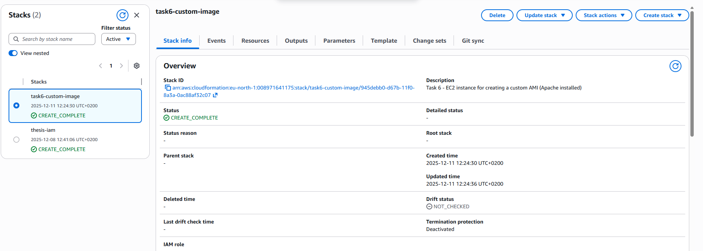
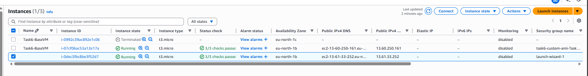
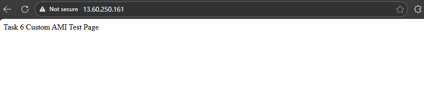
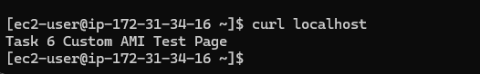
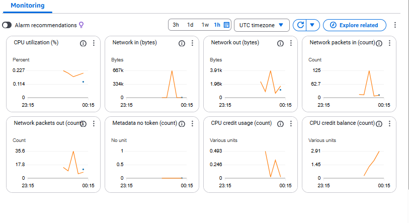
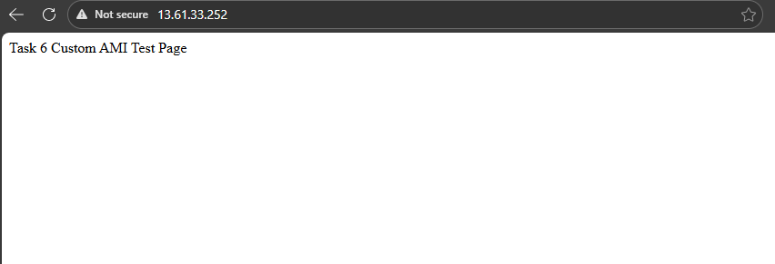
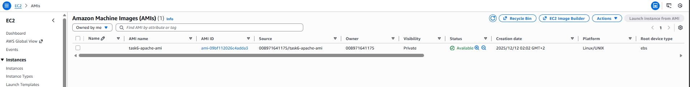
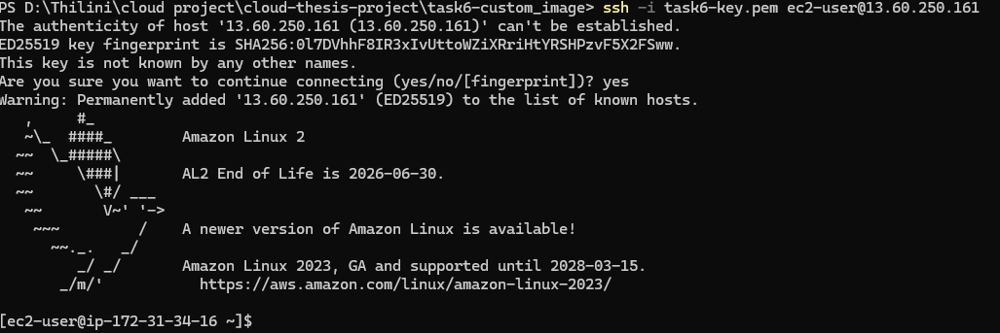

# Task 6 – Custom VM Image (AMI)

## Overview

This task demonstrates how to create a **custom Amazon Machine Image (AMI)** from a configured EC2 instance and then launch a new instance from that AMI.  
The purpose is to prove that a preconfigured virtual machine can be reused without repeating installation steps.

All resources are deployed using **AWS Free Tier–eligible services only**.

---

## Task Goals

- Launch an EC2 instance using CloudFormation (Free Tier)
- Install a web server (Apache HTTP)
- Verify public internet access to the VM
- Create a **custom AMI** from the configured instance
- Launch a new EC2 instance from the AMI
- Verify that the application works without reinstallation
- Document results with screenshots

---

## Architecture Summary

- **Service**: Amazon EC2
- **AMI Base**: Amazon Linux 2 (latest via SSM Parameter)
- **Instance Type**: `t3.micro` (Free Tier eligible)
- **Web Server**: Apache (`httpd`)
- **Protocol**: HTTP (port 80)
- **Deployment Method**: Infrastructure as Code (CloudFormation)

---

## Deployment Steps

### 1. Stack Deployment

The EC2 instance was deployed using a CloudFormation template with the following parameters:

- VPC ID (existing public VPC)
- Public Subnet ID
- EC2 Key Pair
- Security Group allowing:
  - SSH (22)
  - HTTP (80)

Stack creation completed successfully.

📸 **CloudFormation stack status**  

---

### 2. EC2 Instance Verification

After deployment, the EC2 instance was verified in the AWS console.

📸 **EC2 instance details**  

📸 **Running instances overview**  

---

### 3. Apache Installation and Test

Apache was installed automatically using **UserData** during instance launch.

The service was verified using:
- Browser access via public IP
- Local curl command on the instance

📸 **Apache test page (browser)**  

📸 **Apache verified via CLI**  

---

### 4. Monitoring Check (Cost Safety)

Basic monitoring was reviewed to ensure minimal resource usage and Free Tier compliance.

📸 **EC2 Monitoring (low CPU usage)**  

---

### 5. Create Custom AMI

Once the VM setup was verified, a custom AMI was created from the running EC2 instance using:

**EC2 → Actions → Image and templates → Create image**

📸 **Custom AMI created successfully**  

📸 **AMI available state**  

---

### 6. Launch EC2 from Custom AMI

A new EC2 instance was launched using the custom AMI.

- No Apache installation steps were repeated
- Same security group and subnet were used

📸 **SSH access to AMI-based instance**  

📸 **Apache working on AMI-based instance**  

---

## Results

- Apache HTTP server worked correctly on the original EC2 instance
- Custom AMI was successfully created
- A new EC2 instance launched from the AMI worked **without reinstalling Apache**
- This confirms successful VM image creation and reuse

---

## Cost Control and Free Tier Compliance

- Instance type: `t3.micro`
- Storage: default EBS
- Monitoring: basic
- All EC2 instances were **terminated after testing**
- No paid AWS services were used

---

## Conclusion

This task successfully demonstrates how to:
- Prepare a reusable VM configuration
- Create a custom AMI from a working EC2 instance
- Launch new instances from that AMI
- Reduce deployment time using image-based provisioning

This approach is essential for scalable and repeatable cloud deployments.

