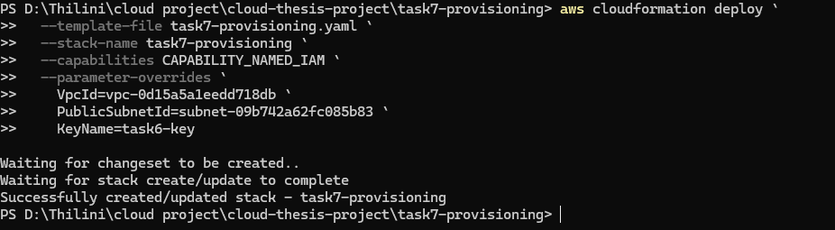
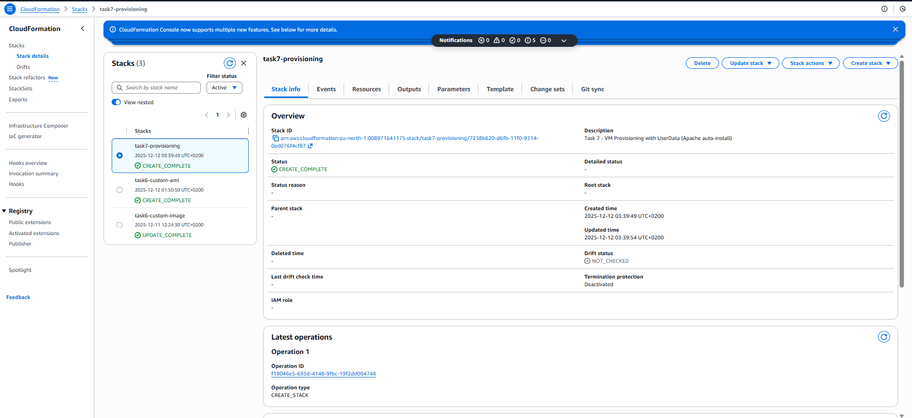
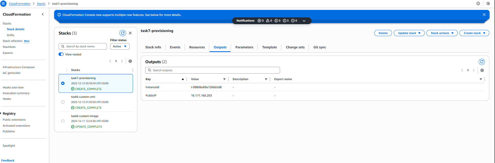
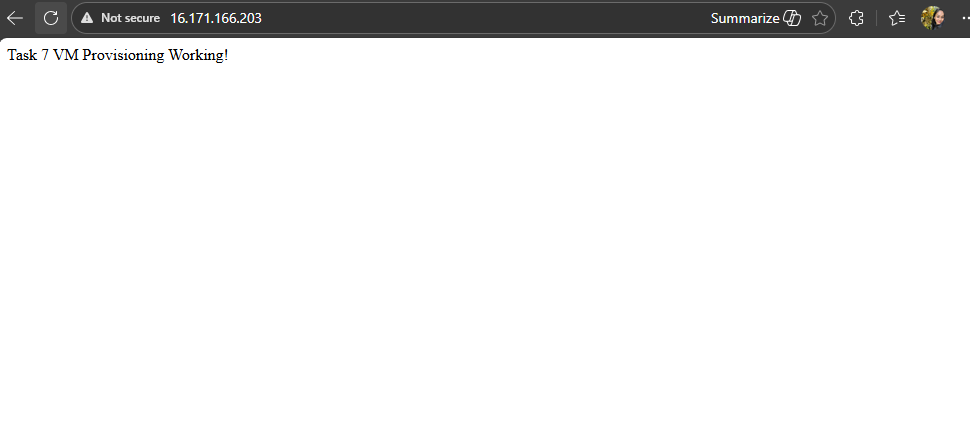

# Task 7: Provisioning 

## Task goals

- Provision an EC2 virtual machine using IaC (CloudFormation)
- Automatically install and configure a web server during VM launch
- Verify that the application is available immediately after provisioning
- Demonstrate successful provisioning using screenshots
- Delete resources after verification to avoid unnecessary costs (AWS Free Tier safe)

---

## Overview

In this task, an EC2 instance is provisioned using **CloudFormation** with **UserData** scripting.
During boot, the VM automatically:

- Updates the system packages
- Installs Apache HTTP Server
- Enables and starts the Apache service
- Serves a test web page to confirm successful provisioning

No manual configuration on the VM is required after launch.

---

## Deployment method

- **Deployment type:** IaC (CloudFormation)
- **Region:** eu-north-1 (Stockholm)
- **Instance type:** Free Tier eligible (t3.micro)
- **OS:** Amazon Linux 2
- **Provisioning method:** EC2 UserData (cloud-init)

---

## CloudFormation deployment

The stack was deployed using AWS CLI:

---

**CloudFormation stack status**  

## Stack outputs

After successful deployment, the EC2 instance public IP address was retrieved from the CloudFormation Outputs section.

---

## Application verification

The service was verified using:
- Browser access via public IP

**Apache test page (browser)**  

---

## Results

- EC2 instance successfully provisioned using CloudFormation
- Apache installed and started automatically using User Data
- Application accessible via public internet

---

## Cost Control and Free Tier Compliance

- Instance type: `t3.micro`
- CloudFormation stack was deleted after verification and documentation.
- No paid AWS services were used

