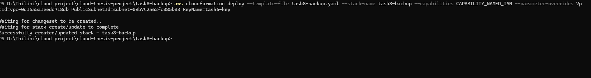
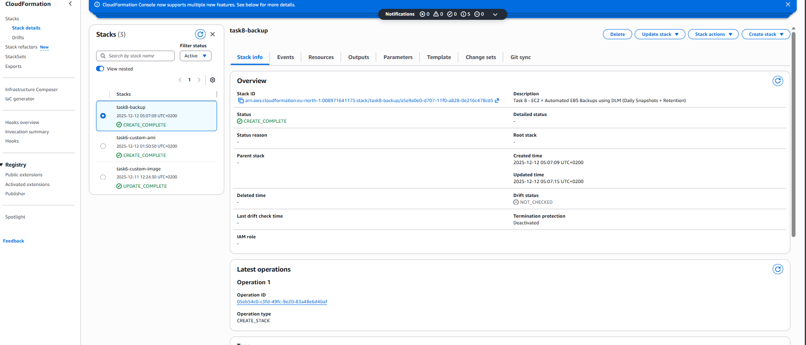
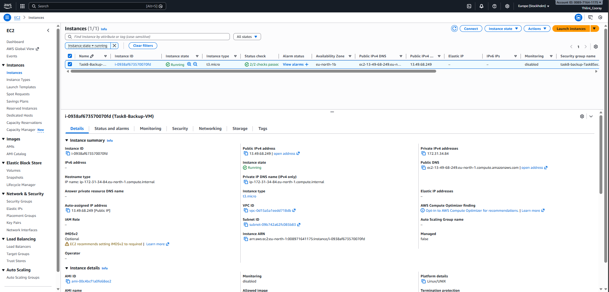
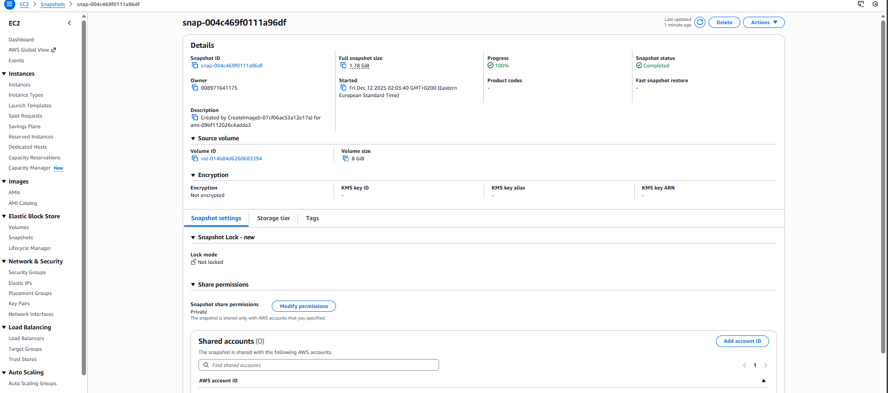
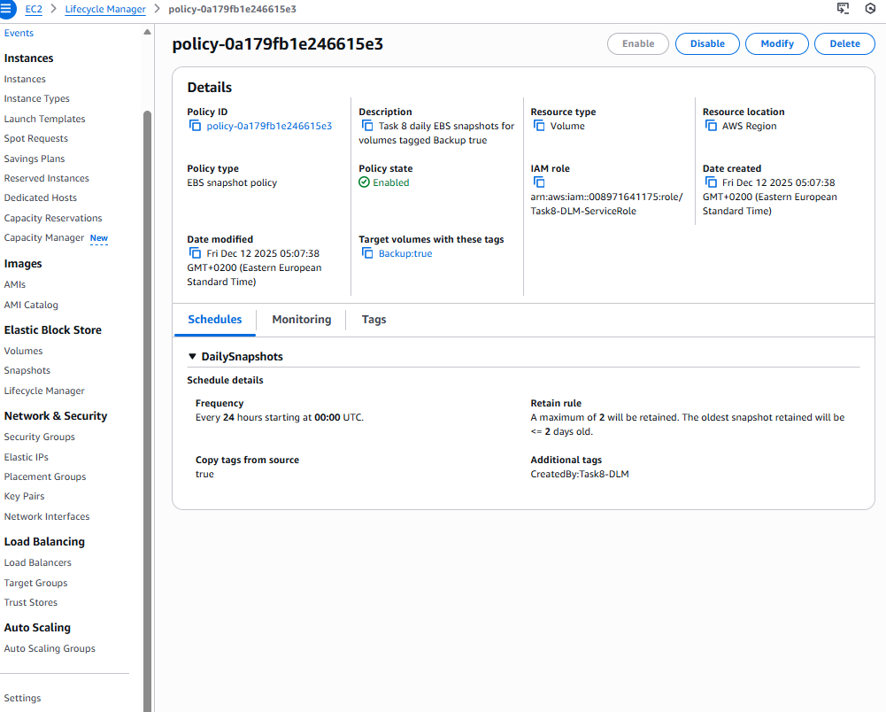
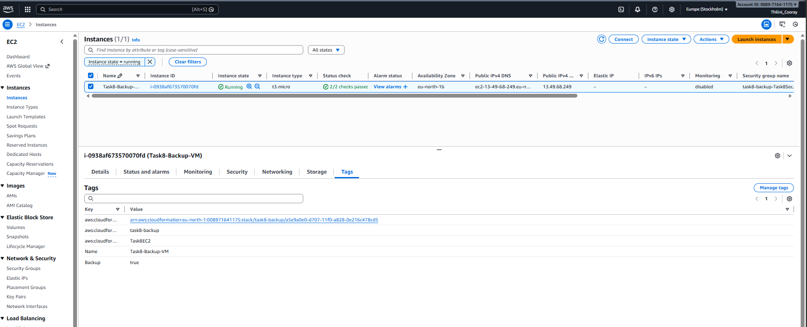

# Task 8: Automated Backups with AWS DLM (EBS Snapshots)

## Task goals

- Configure **automated backups** for an EC2 instance using **AWS Data Lifecycle Manager (DLM)**.
- Daily snapshots are created automatically for volumes tagged with `Backup=true`, and only a limited number of snapshots are retained to avoid unnecessary costs. (02)

---

## Overview

- EC2 instance launched in an existing **public subnet**
- Root EBS volume tagged with `Backup=true`
- AWS DLM Lifecycle Policy:
    - Creates **daily snapshots**
    - Retains **last 2 snapshots only**
- IAM Role allowing DLM to manage snapshots

No manual configuration on the VM is required after launch.

---

## Deploy the stack

```bash
aws cloudformation deploy \
  --template-file task8-backup.yaml \
  --stack-name task8-backup \
  --capabilities CAPABILITY_NAMED_IAM \
  --parameter-overrides \
    VpcId=vpc-xxxxxxxxxxxxxxxxx \
    PublicSubnetId=subnet-xxxxxxxxxxxxxxxxx \
    KeyName=task6-key
```
---

## Verification 

The stack was deployed using AWS CLI:



---

## CloudFormation stack status


## Verify EC2 instance is running



---

## Verify DLM Lifecycle Policy



---

## Verify IAM Role used by DLM

The DLM Lifecycle Policy uses an IAM Role that allows snapshot management
(create, describe, and delete snapshots).



---

## Verify Backup tags on EBS volume



---

## Cost Control and Free Tier Compliance

- Instance type: `t3.micro`
- Retention count is intentionally set to 2 to minimize storage usage
- Stack was deleted after verification to avoid charges.
- No paid AWS services were used
